# AuraSense Architecture and Security Review

**Status:** pre-implementation design. The workspace contained no source, project files, or prior product notes; this proposal assumes AuraSense is a macOS menu-bar utility that observes a paired companion iPhone and locks the Mac when the phone leaves. It does not claim iPhone presence can securely unlock macOS.

## Executive decision

Use an optional iPhone companion app and a Mac CoreBluetooth central for *presence-triggered locking and user-visible proximity*, with a fail-closed `UNKNOWN` state. Bind the phone using an authenticated enrollment protocol, not its advertised name, BLE address, or CoreBluetooth UUID. Treat continuous operation as best effort: iOS may suspend/terminate the app and background peripheral advertisements are throttled and not generally discoverable by arbitrary non-iOS scanners. Therefore the MVP must surface “monitoring unavailable” and must not promise an always-on safety guarantee.

Use Apple Watch Auto Unlock for supported Mac unlock. AuraSense should never type, store, or inject a Mac password. For AuraSense itself, a public supported API for automatically unlocking a macOS login/keychain session from an iPhone presence signal is not available. A phone returning may wake/display the lock screen, but the user still authenticates.

## Architecture

```mermaid
flowchart LR
  subgraph iPhone[ iPhone companion (optional) ]
    Enroll[Explicit enrollment]
    Key[App-held device key]
    BLEP[CoreBluetooth peripheral/service]
    Enroll --> Key --> BLEP
  end
  subgraph Mac[ macOS menu-bar app ]
    BLE[CoreBluetooth central]
    Auth[Peer authenticator]
    Samples[RSSI/sample quality]
    FSM[Proximity state machine]
    Policy[Action policy]
    OS[macOS action adapter]
    UI[Status, settings, diagnostics]
    Store[Keychain + protected preferences]
    BLE --> Auth --> Samples --> FSM --> Policy --> OS
    UI --> Policy
    UI --> Store
    Auth <--> Store
    FSM --> UI
    OS --> UI
  end
  BLE <-->|BLE advertisement / GATT challenge| BLEP
  OS -->|Lock request only| Session[macOS user session]
  Session -. authentication remains system-owned .-> OS
```

### Modules

| Module | Responsibility / boundary |
|---|---|
| Pairing & identity | User-confirmed enrollment; bind a public key to the selected phone; revoke/re-pair; never trust display names or RSSI as identity. |
| BLE transport | CoreBluetooth lifecycle, service discovery, connection/challenge exchange, timestamps, radio state. Bluetooth observations are untrusted input. |
| Peer authenticator | Verify a fresh nonce response with the enrolled key. Keep replay protection and key versioning. A static service UUID is a filter, not proof of identity. |
| Signal processor | Per-device RSSI samples, robust smoothing, sample freshness, confidence and quality flags. |
| Presence engine | `NEAR`, `FAR`, `UNKNOWN` transitions and timers, independent of UI and OS actions. |
| Policy engine | User-configured actions; disabled/paused/monitoring-healthy gates; lock-on-FAR policy; no automatic credential entry. |
| macOS action adapter | Narrow interface (`lock`, `wakeDisplay`, `notify`, `noOp`) with capability reporting and idempotency. Must not claim unlock capability. |
| Settings/status UI | Pairing, action consent, current state, Bluetooth/app health, last valid packet, explanation when state is unknown. |
| Secure storage/logging | Keychain for secrets; minimal preferences; redact identifiers and avoid retaining movement history. |

## Device identification and options

CoreBluetooth `CBPeer.identifier` is an OS-assigned UUID when the local manager first encounters a peer, not an advertised hardware identity. It is useful as a local cache hint, but cannot establish that the discovered device is the user's phone. Apple documents the UUID as locally assigned on first encounter ([CBPeer.identifier](https://developer.apple.com/documentation/CoreBluetooth/CBPeer/identifier)).

| Approach | Strengths | Weaknesses / conclusion |
|---|---|---|
| A. Mac scans all nearby Bluetooth devices | No iPhone app install; simple foreground prototype. | Cannot reliably distinguish the user's iPhone from other phones using public advertisements. Names are mutable/spoofable; addresses are not exposed as stable app identity; RSSI only measures radio conditions. **Do not use as trusted identity or unattended security trigger.** |
| B. Mac + companion app, custom BLE service | Explicit enrollment and protocol-level identity; can challenge a connected phone; works without network. | iOS can suspend/kill the app. Background peripheral advertising changes: local name is omitted, service UUIDs are placed in an overflow area discoverable only by an iOS device explicitly scanning, and advertising frequency may decrease. This makes Mac-as-central background discovery a critical feasibility risk. ([Apple background BLE guide](https://developer.apple.com/library/archive/documentation/NetworkingInternetWeb/Conceptual/CoreBluetooth_concepts/CoreBluetoothBackgroundProcessingForIOSApps/PerformingTasksWhileYourAppIsInTheBackground.html), [startAdvertising](https://developer.apple.com/documentation/corebluetooth/cbperipheralmanager/startadvertising%28_%3A%29?language=objc)) |
| C1. Apple Watch Auto Unlock | Apple-supported unlock flow; system owns credentials and authentication. | Requires Apple Watch, supported devices/settings, same Apple Account with 2FA, passcode, Bluetooth/Wi-Fi; first login after boot/logout still requires password. Not available for an iPhone-only AuraSense unlock. ([Apple Support](https://support.apple.com/en-us/102442)) |
| C2. Phone app + local network rendezvous | App can report presence while active; authenticated TLS can identify enrolled app. | Background execution/network reachability are not a reliable continuous heartbeat; Wi-Fi changes, sleep, AP isolation and app suspension cause false absence. Useful as a supplemental channel, not sole sensor. |
| C3. BLE beacon / iBeacon-style advertisement | Low-data presence beacon; no GATT connection required. | Beacon payloads are replayable and cloneable; RSSI is not distance. iOS beacon advertising/background behavior and scan restrictions remain; static beacon identity is not authentication. Not suitable for unlock. |

**Recommended identity:** during an explicit, physically attended pairing, establish a random per-install key pair on iPhone (private key in Keychain; prefer Secure Enclave where supported), verify a short confirmation on both devices, and store the public key/key identifier on Mac. On GATT connection, Mac sends a cryptographically random nonce; phone signs nonce + protocol version + session context; Mac verifies and accepts RSSI only from an authenticated session. Rotate/revoke explicitly. If protocol requires advertising identity, advertise a rotating opaque token derived from a shared secret; never broadcast a permanent user/device identifier. This stops casual spoofing and replay, but BLE relay attacks remain possible and this does not make proximity a secure unlock factor.

## Apple platform constraints

- iOS foreground-only apps stop peripheral advertising when suspended. Declaring `bluetooth-peripheral` allows certain background tasks and advertisement, but does not grant an always-running process. The system can terminate the app; state restoration can help resume CoreBluetooth work but is not a liveness guarantee.
- In iOS background peripheral mode, the local name is not advertised, service UUIDs move to an overflow area discoverable only by iOS devices explicitly scanning for them, and advertising may slow. That is a direct blocker for dependable Mac scanning while the phone is locked/asleep. Validate on current supported iOS versions and physical hardware before committing to option B.
- In iOS background central mode, scanning must specify service UUIDs; duplicate discoveries are coalesced and scan intervals increase when scanners are backgrounded. A Live Activity on newer iOS may alter some central scanning behavior, but does not create a durable always-on guarantee for this use case. ([Core Bluetooth docs](https://developer.apple.com/documentation/corebluetooth/))
- macOS CoreBluetooth can scan and connect to BLE peripherals, but app-level discovery does not expose a trustworthy, stable Bluetooth MAC identity. Bluetooth power, permission, radio coexistence, sleep, and system scheduling can interrupt observations.
- Treat a missing packet as “no recent evidence,” never as proof the phone departed. Bluetooth being off, permissions denied, app killed, radio interference, or Mac sleep all produce absence-like symptoms.

## Proximity state machine

```mermaid
stateDiagram-v2
  [*] --> UNKNOWN
  UNKNOWN --> NEAR: authenticated fresh samples cross near gate
  UNKNOWN --> FAR: monitoring healthy + far evidence for T_far
  NEAR --> FAR: filtered RSSI below far gate continuously for T_far
  FAR --> NEAR: authenticated samples above near gate continuously for T_near
  NEAR --> UNKNOWN: evidence stale / Bluetooth unavailable / auth lost
  FAR --> UNKNOWN: evidence stale / Bluetooth unavailable / auth lost
  UNKNOWN --> UNKNOWN: monitoring unhealthy; no action
  NEAR --> NEAR: samples in hysteresis band
  FAR --> FAR: samples in hysteresis band
```



**Meaning:** `NEAR` means recent authenticated signal consistent with proximity. `FAR` means the monitor is healthy and has sustained evidence below the far gate. `UNKNOWN` means confidence is insufficient; do not automatically unlock or infer departure. On initial startup, reboot, app relaunch, Bluetooth reset, or permission loss, start `UNKNOWN`.

### RSSI filtering and conceptual gates

RSSI is a noisy, device/orientation/environment-dependent proxy, not a meter reading. Calibrate per Mac/iPhone model in intended use. Start with a rolling 5-sample median (reject isolated outliers), then an EWMA (`alpha` around 0.25–0.4) for display/control. Keep raw samples and timestamps separately; reject stale, unauthenticated, duplicate, and impossible bursts. Avoid smoothing across long gaps.

Use separate entry/exit gates and dwell times. Initial *experimental* starting point only: near-enter above about `-60 dBm` for 3–5 seconds; far-enter below about `-75 dBm` for 15–30 seconds; a 10–15 dB dead band holds the existing state. These numbers must not ship as universal distance thresholds. Require several distinct observations over the dwell period. Tune from recorded distributions across rooms, pockets/bags, body blocking, desk placement and radio conditions.

Mark evidence stale after a configurable age based on measured advertisement cadence (initially 20–30 seconds for the prototype). Stale data transitions to `UNKNOWN`, not `FAR`. Bluetooth powered off, permission denied, manager state unavailable, app explicit pause, failed authentication, or Mac sleeping also forces `UNKNOWN` and disables automatic lock-on-absence. Resume requires fresh authenticated samples and the normal near gate.

### Packet loss / false absence

- Apply `FAR` only while Mac BLE is powered/authorized and a recent authenticated session/sample proves the pipeline is operational; otherwise `UNKNOWN`.
- Use a departure grace timer and dwell window; cancel it immediately on valid authenticated evidence above the near threshold.
- Do not interpret a dropped GATT connection alone as departure. Reconnect with bounded backoff; preserve last-known state only as display context, never as current evidence.
- On phone reboot, app force-quit, Bluetooth toggle, radio interference or OS suspension, show “presence unavailable.” User chooses whether unavailable monitoring locks immediately, after a grace period, or never; safest default for this MVP is no absence-triggered lock while `UNKNOWN`.
- On a confirmed `FAR` transition, issue one idempotent lock request; suppress repeated requests until state changes. Re-entry only wakes display/notification; the OS login screen remains locked.

## Excluding other Bluetooth devices

1. Scan only for the AuraSense service UUID when the platform allows; this reduces noise but is not a security boundary.
2. Require successful challenge-response with the enrolled public key before admitting *any* packet/RSSI sample into the proximity engine.
3. Bind the authenticated BLE session to a fresh random nonce and protocol/session identifier; reject replayed responses, duplicate sequence numbers, malformed messages and stale timestamps.
4. Never filter by peripheral name, manufacturer string, advertised MAC, or “first device found.” Do not accept a matching service UUID as proof of ownership.
5. Allow one explicitly selected enrolled identity for MVP; provide revoke/reset pairing. If multiple devices later, model each independently and define whether any/all enrolled phones satisfy policy.

## Data flow

1. User initiates pairing on both devices and confirms the same short code; key identity is saved securely.
2. Mac scans for the app service and establishes GATT when discoverable. Phone responds to a fresh challenge.
3. Authenticated samples plus RSSI/time/transport health flow to the signal processor.
4. Filtered signal and sample quality update the state machine. State changes include a reason and confidence/health metadata.
5. Policy evaluates state and user settings. Only sustained `FAR` while monitoring is healthy can request a lock.
6. Action adapter reports success/failure; UI explains what happened. No credential or unlock action traverses this pipeline.

## Lock, wake, input and action abstraction

Define an `ActionProvider` capability interface: `lockScreen`, `wakeDisplay`, `notify`, `openSettings`, `noOp`, each returning supported/unsupported, request result and error. Keep policy separate so BLE code cannot directly synthesize events.

- **Supported/native:** macOS provides user-driven screen locking (Control-Command-Q) and Apple Watch Auto Unlock under Apple's stated requirements. The adapter should prefer an explicitly documented/public supported system mechanism if validated for the target macOS release.
- **Possible but fragile:** Accessibility-authorized synthetic keystrokes to invoke the lock shortcut; UI scripting/menu automation; shelling out to undocumented session commands. These depend on focus, permissions, OS UI changes and execution context. A shortcut can be swallowed by another context. Do not make these a silent security guarantee; prototype only behind explicit opt-in and runtime capability checks.
- **Unsafe:** storing or typing the login password; scraping credentials/keychain; weakening login/security policy; privileged helper that bypasses authentication; treating BLE RSSI or possession of a static token as sufficient authentication.
- **Restricted/impossible for a normal third-party app:** bypassing the macOS login window or unlocking a locked session through a public general-purpose API using iPhone proximity. Screen wake is not login unlock. Apple Watch's system-integrated Auto Unlock is the supported consumer path.

Before selecting a lock adapter, validate an API/command against current macOS release, sandboxing, notarization and distribution model. If no supported lock request exists for the chosen distribution, ship proximity monitoring/notifications first and expose lock automation only as an explicitly labeled experimental capability.

## Threat model

**Assets:** user session/data, pairing key, privacy of presence/location patterns, action settings, app integrity.

**Adversaries and failures:** nearby person with their own BLE device; passive observer; active BLE spoof/replay/relay; malicious or compromised companion app/device; another local user/process; lost phone; radio interference; benign OS suspension, battery exhaustion, Bluetooth reset, Mac sleep, or app crash.

| Threat | Mitigation / residual risk |
|---|---|
| Other device imitates name/service | Public-key challenge-response; ignore unauthenticated RSSI. UUID alone is public. |
| Captured response replay | Fresh cryptographic nonce, signed context, replay cache/session binding. |
| Relay attack | Challenge limits replay but not a live relay; RSSI does not stop relay. Do not use for unlocking or high-assurance access. |
| RSSI spoofing / multipath | Hysteresis and dwell reduce noise, not deliberate RF manipulation. State is convenience presence only. |
| App/key compromise | Keychain protection, least privilege, revoke pairing, signed/notarized app, updates; compromised endpoint can sign. |
| False FAR causes lock | Health gating, `UNKNOWN`, grace period, clear status, opt-in policy; lock is inconvenient but should not lose work. |
| False NEAR suppresses lock | Authenticated signal still can be relayed; warn user and keep native macOS lock policy authoritative. |
| Presence history leaks | Avoid persistent RSSI/location logs; short diagnostic ring buffer, redacted identifiers, user-controlled export. |
| Action abuse | Narrow action adapter, no password storage, explicit consent, no arbitrary shell/input API in policy layer. |

**Security claim:** AuraSense can provide a convenience proximity signal and request a lock. It cannot prove physical distance or replace macOS authentication.

## MVP specification

- macOS menu-bar app with Bluetooth/permission/monitor health and visible `NEAR` / `FAR` / `UNKNOWN` state.
- Optional iPhone companion app with explicit foreground pairing and authenticated BLE service; prototype background behavior as a go/no-go experiment before implementing full UX.
- One enrolled iPhone; secure key enrollment, challenge-response, revoke/re-pair.
- Observable RSSI filtering, configurable experimental thresholds/dwell and stale timeout.
- `UNKNOWN` safe behavior, action preview/log, user-controlled auto-lock toggle only after lock adapter feasibility is verified.
- Lock request only; returning phone does not unlock. No passwords, login automation, hidden helpers or persistent location history.
- If background discovery proves unreliable, redefine MVP as active-session/foreground proximity assistance or evaluate a supported accessory/Apple Watch path. Do not market continuous detection.

## Test cases before implementation

**Identity/protocol:** unknown nearby phone; same service UUID spoof; wrong key; replayed signature; stale nonce; malformed and duplicate messages; key rotation/revocation; two enrolled phones; app reinstall and restored backup behavior.

**Signal/state:** calibrated datasets per hardware; phone on desk/in pocket/bag; body blocking; room/wall separation; busy 2.4 GHz environment; RSSI outliers; oscillation around both gates; movement through boundaries; one missed packet; burst loss; sustained absence; late packet after timeout.

**Lifecycle/platform:** iPhone foreground/background/locked screen; force quit; memory pressure termination; reboot; low power mode; Bluetooth off/on; permission denied/revoked; app upgrade; CoreBluetooth restoration; Mac sleep/wake; Bluetooth daemon/radio reset; multiple simultaneous Bluetooth peripherals; every supported iOS/macOS version on physical devices.

**Actions/security:** lock action while app foreground/background; screen already locked; sleep vs lock; external display; no Accessibility permission; permission revoked mid-run; failed/unsupported action; duplicate state transition; phone returns while lock request pending; confirm AuraSense never unlocks, types password, or reports “unlocked.”

**Acceptance gates:** no non-enrolled device can move state to `NEAR`; missing evidence yields `UNKNOWN`; short packet loss never yields immediate `FAR`; unstable RSSI does not flap; unavailable monitoring is visible; lock action is idempotent; no test path can unlock a locked session.

## Recommended implementation order

1. Validate product assumptions, supported OS matrix, distribution/sandbox model, and whether target is lock-only or automation.
2. Run a hardware feasibility spike: iPhone background advertising discovery by a Mac across locked screen, app suspension/termination and reboot. This is the primary go/no-go risk.
3. Separately validate a public and distributable macOS screen-lock request; avoid implementing auto-lock until this is settled.
4. Specify enrollment and threat-reviewed challenge-response protocol; build a small protocol test harness.
5. Implement BLE transport diagnostics and authenticated pairing, without actions.
6. Implement signal processing/state machine with recorded/replayed sample tests.
7. Implement user-visible health/status and UNKNOWN semantics.
8. Add opt-in, idempotent lock adapter only after platform validation; test failures and permissions.
9. Run the full device/lifecycle matrix; document exact coverage and limitations before any “continuous” claim.

## Technical risks / decision points

1. **Critical:** background iOS peripheral advertising may not be discoverable to a Mac scanner because UUIDs move to an iOS-only overflow mechanism; verify immediately on devices, not simulators.
2. **High:** iOS process lifetime and BLE cadence cannot be promised; this affects both accuracy and power use.
3. **High:** no general public iPhone-driven macOS unlock API; keep native authentication in control.
4. **High:** RSSI is not distance and is vulnerable to environment and relay; position feature as convenience.
5. **Medium:** macOS lock triggering may require fragile Accessibility/UI automation depending on distribution and supported API availability.
6. **Medium:** CoreBluetooth peer UUID is a local assigned identifier and may not survive system/app lifecycle in the way product identity needs.
7. **Product decision:** define desired fail behavior when monitor is `UNKNOWN`; automatic locking during sensor failure harms usability, while assuming `NEAR` harms privacy. MVP recommendation: surface unknown, do not claim presence, and let the user choose whether unknown should lock after grace.

## References

- Apple, [Core Bluetooth background processing for iOS apps](https://developer.apple.com/library/archive/documentation/NetworkingInternetWeb/Conceptual/CoreBluetooth_concepts/CoreBluetoothBackgroundProcessingForIOSApps/PerformingTasksWhileInTheBackground.html)
- Apple, [`CBPeripheralManager.startAdvertising`](https://developer.apple.com/documentation/corebluetooth/cbperipheralmanager/startadvertising%28_%3A%29?language=objc)
- Apple, [`CBCentralManager.scanForPeripherals`](https://developer.apple.com/documentation/corebluetooth/cbcentralmanager/scanforperipherals%28withservices%3Aoptions%3A?changes=la_9___8__5__1&language=objc)
- Apple, [`CBPeer.identifier`](https://developer.apple.com/documentation/CoreBluetooth/CBPeer/identifier)
- Apple Support, [Unlock your Mac with Apple Watch](https://support.apple.com/en-us/102442)
- Apple Support, [Mac keyboard shortcuts (lock screen)](https://support.apple.com/en-us/102650)
- Apple, [Authorization Services](https://developer.apple.com/documentation/security/authorization-services?language=objc)
