# AuraSense Architecture and Security Review

**Status:** implementation in progress. AuraSense is a Mac-only Swift package targeting macOS 26 and later. The source provides BLE discovery, explicit nearby-peer selection, selected-peer filtering, RSSI state tracking, diagnostics, a menu-bar UI, display-wake requests, and an experimental private-API screen-lock request. Unlocking is not implemented. No iOS companion app is part of the product.

## Executive decision

Use the Mac's CoreBluetooth central to scan for nearby BLE devices, let the user select the iPhone, and monitor the selected peer using available CoreBluetooth identity plus RSSI. BLEUnlock documents a no-phone-app path and says Apple devices signed in to the same Apple Account may expose a resolved stable address to its scanner; treat this as a behavior to validate on actual hardware, not a public Apple identity guarantee. Missing, changing, or ambiguous identity means `UNKNOWN`, not `FAR`.

BLEUnlock uses a stored login password and Accessibility-authorized input. AuraSense rejects this approach: it does not store or inject Mac login credentials. A public general-purpose API for third-party iPhone-proximity authentication is unavailable. Apple Watch Auto Unlock remains an independent macOS feature; AuraSense cannot initiate or control it.

## Verified implementation status

- CoreBluetooth scanning and peer discovery are implemented. The selected peer is matched using its local `CBPeer.identifier`, which is not cryptographic identity and may not be stable across all system conditions.
- RSSI median/EWMA filtering, hysteresis, dwell, stale-evidence handling, countdown, candidate ambiguity checks, scanner recovery, diagnostics, settings persistence, and a menu-bar interface are implemented with unit tests.
- Display wake requests use an IOKit user-activity assertion with a `caffeinate` fallback. Success means the request was accepted, not that a sleeping Mac or external monitor woke; validate on target hardware.
- Screen lock calls `SACLockScreenImmediate` from private `login.framework`, matching BLEUnlock/BLELock. On the current M4/macOS 27.0.1 host the symbol resolved, returned success, and the session detector observed the locked state. This is undocumented, unsupported by Apple, and may break; it is experimental. Unit tests inject a fake lock mechanism; automatic proximity-triggered operation with a phone has not been tested end-to-end.
- Clicking the menu-bar phone-and-lock icon opens a status popover with the selected phone, recent RSSI/presence, policy toggles, Lock Now, and diagnostics. “Open AuraSense” opens a native resizable dashboard showing proximity, radio/permission state, the selected iPhone, nearby BLE devices, automation settings, and diagnostics actions. First launch automatically opens device setup if no phone is selected. The live setup window shows clickable nearby-device rows and RSSI; without a selection, all peripherals remain blocked. The selected CoreBluetooth identifier is not proof of ownership.
- The dashboard and setup UI use native AppKit controls and system colors; dashboard status refreshes from the diagnostics snapshot while open. Accessibility permission is not used to enter credentials. No automatic unlock path is implemented or supported by AuraSense.
- `scripts/build_dmg.sh` builds `build/AuraSense.dmg` with a custom phone-and-lock app icon, high-contrast branded Finder background, saved drag-to-Applications layout, and no runtime dependencies. The current bundle is ad-hoc signed only, not notarized.
- BLE-triggered OS unlocking and credential entry are disabled. The credential vault now stores imported password secrets in the macOS Keychain with device-only, user-presence access control; its JSON file contains metadata only. Apple system credential-exchange payload handling supports password items only. The required credential-provider extension and app activity handoff are not yet part of this Swift-package app bundle, so end-to-end import from a password manager is not yet wired.
- AuraSense does not determine whether the display is asleep, the Mac is sleeping, a session is locked, or the login window/FileVault is active. It cannot change those authentication states. Closed-lid external-display operation depends on macOS clamshell and power behavior.
- No `.entitlements` file, Xcode project, signing, or notarization configuration is present. The app bundle is assembled by `scripts/build_app.sh`.

## Architecture

```mermaid
flowchart LR
  subgraph Mac[ macOS menu-bar app ]
    BLE[CoreBluetooth central]
    Filter[Advertisement classifier]
    Samples[RSSI/sample quality]
    FSM[Proximity + countdown state machine]
    Policy[Action policy]
    OS[macOS lock/wake/unlock adapter]
    UI[Native menu bar UI + setup]
    Store[Protected preferences]
    BLE --> Filter --> Samples --> FSM --> Policy --> OS
    UI --> Policy
    UI --> Store
    FSM --> UI
    OS --> UI
  end
  iPhone[Nearby iPhone broadcasts (system-controlled)] -->|observable BLE advertisements, when available| BLE
  OS -->|best-effort display wake request| Session[macOS session + displays]
```

### Modules

| Module | Responsibility / boundary |
|---|---|
| BLE transport | CoreBluetooth lifecycle, discovery, timestamps, radio state and power-aware scan scheduling. Bluetooth observations are untrusted input. |
| Advertisement classifier | User-selected CoreBluetooth peer tracking and candidate consistency. Peer identity is not cryptographically verified; ambiguous matches mean `UNKNOWN`. |
| Signal processor | Per-device RSSI samples, robust smoothing, sample freshness, confidence and quality flags. |
| Presence engine | `NEAR`, `FAR`, `UNKNOWN` transitions and timers, independent of UI and OS actions. |
| Policy engine | User-configured actions; 5-second cancellable departure countdown; healthy-monitor gate. Credential entry is disabled. |
| macOS action adapter | Narrow interface with capability reporting. Screen lock uses a runtime-resolved private macOS symbol and verifies locked state; credential entry remains unsupported. |
| Settings/status UI | Clean native menu-bar popover, clear state/countdown/cancel, device selection, onboarding, permissions and settings. |
| Credential vault | Password values are stored in Keychain, gated by user presence and available only while unlocked on this Mac. Import mapping accepts password entries from an Apple credential-exchange payload; passkeys and other item types are deliberately skipped. It is separate from proximity and never stores the Mac login password. |

## Device identification and options

CoreBluetooth `CBPeer.identifier` is an OS-assigned UUID when the local manager first encounters a peer, not an advertised hardware identity. It is useful as a local cache hint, but cannot establish that the discovered device is the user's phone. Apple documents the UUID as locally assigned on first encounter ([CBPeer.identifier](https://developer.apple.com/documentation/CoreBluetooth/CBPeer/identifier)).

| Approach | Strengths | Weaknesses / conclusion |
|---|---|---|
| A. Mac scans all nearby Bluetooth devices | No iPhone app install; simple foreground prototype. | Cannot reliably distinguish the user's iPhone from other phones using public advertisements. Names are mutable/spoofable; addresses are not exposed as stable app identity; RSSI only measures radio conditions. **Do not use as trusted identity or unattended security trigger.** |
| B. Mac + companion app, custom BLE service | Explicit enrollment and protocol-level identity; can challenge a connected phone; works without network. | iOS can suspend/kill the app. Background peripheral advertising changes: local name is omitted, service UUIDs are placed in an overflow area discoverable only by an iOS device explicitly scanning, and advertising frequency may decrease. This makes Mac-as-central background discovery a critical feasibility risk. ([Apple background BLE guide](https://developer.apple.com/library/archive/documentation/NetworkingInternetWeb/Conceptual/CoreBluetooth_concepts/CoreBluetoothBackgroundProcessingForIOSApps/PerformingTasksWhileYourAppIsInTheBackground.html), [startAdvertising](https://developer.apple.com/documentation/corebluetooth/cbperipheralmanager/startadvertising%28_%3A%29?language=objc)) |
| C1. Apple Watch Auto Unlock | Apple-supported unlock flow; system owns credentials and authentication. | Requires Apple Watch, supported devices/settings, same Apple Account with 2FA, passcode, Bluetooth/Wi-Fi; first login after boot/logout still requires password. Not available for an iPhone-only AuraSense unlock. ([Apple Support](https://support.apple.com/en-us/102442)) |
| C2. Phone app + local network rendezvous | App can report presence while active; authenticated TLS can identify enrolled app. | Background execution/network reachability are not a reliable continuous heartbeat; Wi-Fi changes, sleep, AP isolation and app suspension cause false absence. Useful as a supplemental channel, not sole sensor. |
| C3. BLE beacon / iBeacon-style advertisement | Low-data presence beacon; no GATT connection required. | Beacon payloads are replayable and cloneable; RSSI is not distance. iOS beacon advertising/background behavior and scan restrictions remain; static beacon identity is not authentication. Not suitable for unlock. |

**Identity conclusion:** the Mac can manually select a candidate and track its CoreBluetooth peer identifier. The UUID is locally assigned, not cryptographic identity. BLEUnlock reports Apple devices on the same Apple Account may resolve to a stable address; validate on supported hardware/OS versions and never treat it as a security guarantee. If identity becomes ambiguous, transition to `UNKNOWN` and perform no automatic action.

## User experience and packaging

- Clicking the menu-bar phone-and-lock icon opens a native popover with presence, selected phone, recent signal, Auto-Lock/Auto-Wake, Lock Now, diagnostics, and quit.
- On first launch without a selected phone, AuraSense automatically opens device setup. The popover's “Choose your iPhone…” / “Change trusted iPhone…” action opens the same live nearby-device list, which shows names, signal strength, and local IDs. Select a device explicitly; until then, all peripherals remain blocked. Names and RSSI are descriptive, not identity proof.
- The setup window refreshes device rows continuously and offers a manual rescan. A dedicated preferences window and editable RSSI/timer controls remain planned.
- `scripts/build_dmg.sh` produces the phone-and-lock app icon, high-contrast branded Finder background, and drag-to-Applications layout. The app is ad-hoc signed and not notarized; first launch still requires macOS Bluetooth permission.

### Proposed credential-vault onboarding (not implemented)

The vault is a separate credential-management capability; it does not enable Mac proximity unlocking or store the Mac login password. Password secrets are held in Keychain under `WhenUnlockedThisDeviceOnly` plus user-presence access control. Metadata remains in the app-support JSON file. The current import mapper supports basic username/password records only; passkey private-key handling is not implemented.

**Import integration status:** AuraSense can map `ASExportedCredentialData` password entries into Keychain-backed records. Apple's documented exchange flow also requires a credential-provider extension declaring credential-exchange support and an app `NSUserActivity` receiver. `scripts/build_app.sh` currently bundles only the SwiftPM executable and does not create that extension, so the complete system-mediated transfer cannot yet be initiated/received by the shipped app.

On first launch, show this simple choice before setting up the credential vault:

> **Welcome to AuraSense**  
> Choose how you'd like to start.
>
> **Import existing credentials**  
> Bring compatible passwords and passkeys from an existing credential manager.
>
> **Start fresh**  
> Create a new AuraSense credential vault.
>
> **Skip for now**

- **Import existing credentials:** use Apple's AuthenticationServices credential-exchange flow where supported. AuraSense acts as an importer via `ASCredentialImportManager`. A compatible source manager must initiate export; AuraSense cannot invoke the importer API to browse/pull another app's database. The user chooses AuraSense in Apple's out-of-process system flow, which mediates app identity and transfer. The onboarding action should explain this handoff and resume when the system launches AuraSense for the exchange. Import only user-selected data, review results/duplicates, then encrypt and save to AuraSense's vault. Passwords and passkeys are in scope; preserve passkey relying-party, user, and credential metadata. Do not assume the iCloud Keychain/Passwords store is directly readable or that its current implementation exports every item. Validate whether Passwords on macOS 26 and iOS 26 can export passwords and passkeys through this flow, and test source-app interoperability, cancellation, and errors on real devices.
- **Start fresh:** create an empty AuraSense vault and encryption-key hierarchy. Store credential records in a local encrypted database; protect a random vault key with platform Keychain and device-bound key protection/Secure Enclave-backed key operations where supported. Secure Enclave protects or wraps keys; it is not general-purpose storage for imported password/passkey records. Imported passkey private-key material needs encrypted vault storage and a validated key-handling design.
- **Skip for now:** continue without importing or creating a populated vault. Offer “Set up credential vault” in settings. Do not prompt again until the user initiates setup.
- **At rest and access:** encrypt imported/created credential data before persistence. Store wrapping keys and secrets in Keychain/Security with restrictive accessibility and access controls. On iPhone, use `LocalAuthentication` and Keychain access control to require Face ID/Touch ID before decrypting sensitive vault material, with a deliberate recovery/fallback policy. AuraSense receives only authentication success/failure; it never accesses, stores, or transmits biometric templates/data. On Mac, use available local owner authentication (such as Touch ID where present); do not assume all Macs have biometrics.
- **Keep these components distinct:** (1) Apple's iCloud Keychain/Passwords is Apple's private credential service/database; AuraSense has no direct database access and must not scrape, extract, silently copy, or synchronously mirror it. (2) AuraSense's vault is AuraSense-owned encrypted local storage for credentials deliberately imported or created in AuraSense. (3) Apple's Credential Provider/AutoFill extension offers AuraSense's own records to system AutoFill after the user enables the provider; it is not a bulk-import API and grants no access to Apple's vault. (4) AuraSense iPhone biometric authorization is a local gate implemented by an iOS app through LocalAuthentication/Keychain; it does not itself authenticate the Mac. (5) AuraSense's Mac–iPhone protocol is a separate mutually authenticated, encrypted channel for pairing, authorization requests, and optional encrypted vault sync; AuthenticationServices credential exchange does not define this protocol.
- **Local-first and sync:** keep the primary vault local to each device. Future Mac–iPhone sync must be end-to-end encrypted, mutually authenticated, replay-resistant, and revocable. Credentials must remain usable offline after local authorization; internet access is not required for each credential-use operation. This sync is separate from iCloud Keychain sync.
- **Architecture delta:** iPhone-side Face ID/Touch ID authorization and a Mac–iPhone secure channel require an AuraSense iPhone app, changing the earlier Mac-only/no-iOS-app assumption for credential-vault features. This does not change the Mac-only BLE presence sensor. If an iPhone app remains out of scope, defer iPhone biometrics and the Mac–iPhone protocol and use local Mac authentication for the Mac vault.
- **API validation:** Apple's credential exchange APIs support participating credential managers exchanging credentials, including passwords and passkeys, through system-mediated export/import. Validate macOS 26/iOS 26 SDK availability, required credential-provider extension declarations, activity routing, Passwords-app export for passwords versus passkeys, provider enablement UX, and imported credential fidelity before promising the import button works with Apple's Passwords app.

## Apple platform constraints

- iOS foreground-only apps stop peripheral advertising when suspended. Declaring `bluetooth-peripheral` allows certain background tasks and advertisement, but does not grant an always-running process. The system can terminate the app; state restoration can help resume CoreBluetooth work but is not a liveness guarantee.
- In iOS background peripheral mode, the local name is not advertised, service UUIDs move to an overflow area discoverable only by iOS devices explicitly scanning for them, and advertising may slow. That is a direct blocker for dependable Mac scanning while the phone is locked/asleep. Validate on current supported iOS versions and physical hardware before committing to option B.
- In iOS background central mode, scanning must specify service UUIDs; duplicate discoveries are coalesced and scan intervals increase when scanners are backgrounded. A Live Activity on newer iOS may alter some central scanning behavior, but does not create a durable always-on guarantee for this use case. ([Core Bluetooth docs](https://developer.apple.com/documentation/corebluetooth/))
- macOS CoreBluetooth can scan and connect to BLE peripherals, but app-level discovery does not expose a trustworthy, stable Bluetooth MAC identity. Bluetooth power, permission, radio coexistence, sleep, and system scheduling can interrupt observations.
- Treat a missing packet as “no recent evidence,” never as proof the phone departed. Bluetooth being off, permissions denied, app killed, radio interference, or Mac sleep all produce absence-like symptoms.

## Proximity state machine

```mermaid
stateDiagram-v2
  [*] --> UNKNOWN
  UNKNOWN --> NEAR: candidate signal crosses near gate with adequate confidence
  UNKNOWN --> FAR: healthy scan + sustained absence after startup grace
  NEAR --> COUNTDOWN: candidate signal absent / below far gate for T_far
  COUNTDOWN --> NEAR: candidate returns above near gate; cancel timer
  COUNTDOWN --> FAR: 5 seconds elapse and scan remains healthy
  FAR --> NEAR: candidate returns above near gate / request display wake
  NEAR --> UNKNOWN: scan unavailable / evidence stale / ambiguous peers
  FAR --> UNKNOWN: scan unavailable / evidence stale / ambiguous peers
  COUNTDOWN --> UNKNOWN: scan unavailable; cancel timer
  UNKNOWN --> UNKNOWN: monitoring unhealthy; no action
  NEAR --> NEAR: samples in hysteresis band
  FAR --> FAR: samples in hysteresis band
```



**Meaning:** `NEAR` means the selected candidate is observed above the near gate; this is convenience presence, not cryptographic authentication. `COUNTDOWN` visibly counts down and cancels as soon as the candidate returns. `FAR` follows the configured dwell and countdown while monitoring remains healthy. Startup remains `UNKNOWN` until the selected peer has been observed. Authentication and operating-system unlocking are not implemented.

### RSSI filtering and conceptual gates

RSSI is a noisy, device/orientation/environment-dependent proxy, not a meter reading. Calibrate per Mac/iPhone model in intended use. Start with a rolling 5-sample median (reject isolated outliers), then an EWMA (`alpha` around 0.25–0.4) for display/control. Keep raw samples and timestamps separately; reject stale, duplicate, and impossible bursts. Avoid smoothing across long gaps. Since Mac-only observations are unauthenticated, RSSI must be treated as convenience telemetry only.

Use separate entry/exit gates and dwell times. Initial *experimental* starting point only: near-enter above about `-60 dBm` for 3–5 seconds; far-enter below about `-75 dBm` for 15–30 seconds; a 10–15 dB dead band holds the existing state. These numbers must not ship as universal distance thresholds. Require several distinct observations over the dwell period. Tune from recorded distributions across rooms, pockets/bags, body blocking, desk placement and radio conditions.

Mark evidence stale after a configurable age based on measured advertisement cadence. A missing packet is not by itself evidence of departure: transition to countdown only after the scanner is demonstrably healthy and the candidate was recently observed. Bluetooth powered off, permission denied, manager unavailable, Mac sleeping, or ambiguous candidate set forces `UNKNOWN` and cancels countdown. Returning to `NEAR` requires fresh samples above the near gate.

### Packet loss / false absence

- Apply `FAR` only while Mac BLE is powered/authorized and scan callbacks continue; otherwise use `UNKNOWN`.
- Begin the visible five-second countdown only after a measured departure dwell/grace interval; cancel immediately on near evidence or health loss.
- Use bounded scan duty cycles and event-driven manager callbacks; avoid tight polling. Expose scan cadence and energy impact in diagnostics. The exact low-power schedule must be measured because reduced scanning trades responsiveness for battery use.
- When signal is absent or Bluetooth is interrupted, show “monitoring unavailable”; do not start or finish countdown while `UNKNOWN`.
- On countdown completion, the policy requests the experimentally verified private-API screen lock when enabled. On return, it can request display wake; it does not unlock.

## Excluding other Bluetooth devices

1. Scan only for an observed signal pattern/advertisement fields that current macOS APIs expose; this is noise reduction only.
2. Do not admit arbitrary nearby device RSSI. Require the chosen candidate's observable attributes to match the user's manual selection, while labeling that selection spoofable and non-secure.
3. Never treat peripheral name, advertised address, manufacturer data, service UUID, or CoreBluetooth UUID as proof of ownership; those attributes can be absent, change, or be imitated.
4. If multiple candidates match, identity becomes ambiguous: set `UNKNOWN`, cancel countdown, and do not lock based on their combined RSSI.
5. Mac-only filtering cannot cryptographically exclude all other devices. This is an accepted limitation for a convenience prototype, not acceptable as a security/access-control boundary.

## Data flow

1. User selects a nearby candidate in Mac settings; AuraSense records only the available local selection metadata.
2. CoreBluetooth scans on a power-aware schedule and reports candidate advertisements and RSSI.
3. Classifier checks candidate consistency and ambiguity; signal processor attaches freshness and scan-health metadata.
4. Filtered signal updates `UNKNOWN` / `NEAR` / departure grace / five-second countdown / `FAR`.
5. Countdown completion requests the experimental private-API screen lock when enabled. Return to range may request display wake only.
6. UI reports decision/action result. Since there is no phone-side app, no cryptographic challenge or trustworthy device enrollment exists.

## Lock, wake, input and action abstraction

Define an `ActionProvider` capability interface: `requestLock`, `wakeDisplay`, `requestCredentialEntry`, `notify`, `openSettings`, `noOp`, each returning supported/unsupported, request result and error. Keep policy separate so BLE code cannot directly synthesize events.

- **Supported/native:** CoreBluetooth scanning and user-driven macOS authentication are available platform behaviors. Apple Watch Auto Unlock is independent macOS functionality; AuraSense cannot invoke it. Third-party BLE presence is not a native macOS authentication factor.
- **Rejected (BLEUnlock model):** AuraSense will not collect, store, or inject the login password. Accessibility-based typing is fragile, exposes credentials to focus errors, and cannot cover FileVault/pre-login authentication.
- **Fragile:** Accessibility keystrokes for lock shortcuts, UI scripting, and undocumented session commands. Validate per macOS release. Display wake can be requested; external monitor behavior follows system/hardware power state and cannot be independently guaranteed.
- **Unsafe:** storing credentials outside Keychain; logging/exposing credentials; disabling login protections; blind/repeated typing; entering credentials unless the expected lock UI and selected peer are confirmed; treating BLE RSSI as proof of identity or distance.
- **Restricted:** a public general-purpose API for third-party iPhone-proximity authentication is not available. BLEUnlock works around this by injecting the user's stored password; it does not use native Auto Unlock or bypass the login credential.

Validate wake behavior on supported macOS versions and external-display hardware. A signed/notarized DMG and distribution configuration are not yet present. First launch still requires user-granted Bluetooth permission; a DMG cannot grant privacy permissions silently.

## Threat model

**Assets:** user session/data, privacy of presence/location patterns, action settings, app integrity.

**Adversaries and failures:** nearby person with their own BLE device; passive observer; active BLE spoof/replay; another local user/process; lost phone; radio interference; benign OS scheduling, battery exhaustion, Bluetooth reset, Mac sleep, or app crash.

| Threat | Mitigation / residual risk |
|---|---|
| Other device imitates observed advertisement | Not preventable cryptographically without phone-side participation. Candidate selection is spoofable; do not enter credentials for ambiguous peers. |
| Replay or relay | Mac-only public advertisements cannot provide challenge-response; spoof/replay and relay remain residual risks. |
| RSSI spoofing / multipath | Hysteresis and dwell reduce accidental noise, not deliberate RF manipulation. State is convenience presence only. |
| False FAR causes lock | Health gating, `UNKNOWN`, departure grace, visible five-second countdown, and cancel-on-return reduce nuisance locks. |
| False NEAR triggers an action | Spoofed/relayed candidate may request an action. The local peer UUID is not proof of ownership; automatic unlock is disabled. |
| Presence history leaks | Avoid persistent RSSI/location logs; short diagnostic ring buffer, redacted identifiers, user-controlled export. |
| Credential theft/action abuse | AuraSense does not store or inject the Mac login credential. BLE observations remain untrusted input and must not authorize OS authentication. |

**Security claim:** AuraSense provides convenience proximity automation only. BLE cannot prove physical distance or device identity. AuraSense does not unlock a macOS session.

## MVP specification

- Mac-only menu-bar app with Bluetooth/monitor health and visible `NEAR` / `FAR` / `UNKNOWN` state.
- User selects a candidate iPhone from observable nearby devices; UI clearly explains that selection is not secure identity.
- Power-aware scanning, RSSI median/EWMA, configurable experimental thresholds/dwell and stale timeout.
- On sustained departure, show a visible five-second cancellable countdown, then request lock if monitoring is healthy and the lock adapter is verified.
- On return, request display wake. Automatic unlock is unsupported and will not be implemented through password injection.
- `UNKNOWN` cancels countdown and performs no automatic action or credential entry. No hidden helpers or persistent location history.
- Native Swift/AppKit + CoreBluetooth; no Homebrew/Python/Node/third-party daemon runtime dependency. Signing/notarization is not configured.
- Label monitoring as best effort; do not market guaranteed continuous detection or security-grade presence.

## Test cases before implementation

**Identity/classification:** no phone nearby; selected phone candidate; second iPhone with same name; spoofed name/manufacturer/service data; rotating/private addresses; several matching devices; candidate disappears and reappears; stale CoreBluetooth peer UUID; prove UI never labels a candidate cryptographically verified.

**Signal/state:** calibrated datasets per hardware; phone on desk/in pocket/bag; body blocking; room/wall separation; busy 2.4 GHz environment; RSSI outliers; oscillation around both gates; movement through boundaries; one missed packet; burst loss; sustained absence; late packet after timeout.

**Lifecycle/platform:** iPhone screen locked/asleep; iPhone reboot; low power mode; Bluetooth off/on; Mac permission denied/revoked; Mac sleep/wake; Bluetooth radio reset; many simultaneous peripherals; macOS 26 and later on actual Mac/iPhone hardware. Measure scan energy at idle and during transitions.

**Actions/security:** countdown is visible/cancellable; health loss cancels; private-API lock is experimentally verified on macOS 27.0.1 only; credential entry remains disabled; verify display wake and clamshell behavior on external display; never send credentials to locked-session or pre-login UI.

**Acceptance gates:** ambiguous/no evidence yields `UNKNOWN`; brief packet loss does not trigger immediate departure; unstable RSSI does not flap; countdown is visible/cancellable; monitoring loss prevents actions; lock must be verified on target OS and unlock remains unsupported. Document spoofing risk.

## Phased Implementation Roadmap and Engineering Milestones

The project progresses incrementally through seven disciplined phases, validating stability and security gates at each step:

### Phase 1: Native macOS Agent & BLE Discovery (Completed Baseline)
- Native macOS command-line/agent foundation and SPM architecture.
- CoreBluetooth central manager wrapper (`BLEScannerProtocol`, `CoreBluetoothScanner`) with continuous RSSI reporting.
- Diagnostic registry (`PeripheralRegistry`) with packet counts, liveness indicators, and signal calculations.
- Diagnostic ring buffer and reporter (`DiagnosticsManager`) with ASCII and JSON export.
- **Security Boundary:** Explicitly enforce Phase 1 lock/unlock ban (`Phase1RestrictedActionProvider`). Zero OS session modifications allowed.

### Phase 2: Trusted Device Registration & Candidate Classifier
- Device identity abstraction (`CandidateDevice`) tracking user-selected BLE candidate (`CBPeer.identifier`, name, service UUIDs).
- Explicit acknowledgment that candidate identity is local and non-cryptographic (no iOS companion app).
- `AdvertisementClassifier` providing candidate matching, ambiguity detection (multiple matching peers force `UNKNOWN`), and signal gating.
- Isolation boundary preventing non-candidate BLE traffic from reaching security and proximity state.

### Phase 3: Proximity State Machine & Cancellable Countdown
- Signal smoothing pipeline: rolling 5-sample median followed by EWMA filter (`alpha` 0.25–0.40).
- Configurable dual gates with hysteresis band (e.g. Near-enter > -60 dBm, Far-enter < -75 dBm) and dwell windows.
- State machine: `UNKNOWN` -> `NEAR` -> `COUNTDOWN` (5-second visible countdown: 5, 4, 3, 2, 1) -> `FAR`.
- Departure grace and cancellation: candidate return above near gate or scan degradation immediately cancels countdown.
- Temporary packet loss tolerance without flapping.

### Phase 4: Automatic Mac Locking
- Idempotent macOS lock screen request (`requestLock`) triggered strictly on countdown completion.
- Fail-safe gating: lock requests blocked if scan is unhealthy, state is `UNKNOWN`, or candidate is ambiguous.
- Comprehensive testing in foreground, background, and multi-display scenarios before touching unlock.

### Phase 5: Display Wake & Action Isolation
- Implement display wake request (`wakeDisplay`) on return from `FAR`/`UNKNOWN` to `NEAR`.
- Keep action layer strictly isolated from BLE transport and state machine logic.
- Validate display sleep vs system sleep behaviors and capability reporting.

### Phase 6: Authentication & Unlock Path Research & Hardening
- Research and validate secure unlock paths on macOS 26+.
- Strictly prohibit plaintext password storage in preferences, files, or memory dumps.
- Document Apple Watch Auto Unlock as an independent macOS feature, not controlled by AuraSense.
- Keep BLEUnlock-style password storage and Accessibility injection rejected.

### Phase 7: Menu Bar UI, Lifecycle Recovery & Production Polish
- Native macOS menu bar popover (SwiftUI/AppKit) with monochrome template icon and status dot.
- Live 5-second countdown display with immediate "Cancel / I'm Here" button.
- Device pairing/selection picker, settings sheet, and launch-at-login integration.
- Power-aware scan duty cycling and sleep/wake/Bluetooth radio reset recovery.
- Signed and notarized DMG packaging.

## Technical risks / decision points

1. **Critical:** On macOS 26+, Mac-only CoreBluetooth may not expose stable iPhone identity or advertisements in all states; same-account Apple identity resolution is BLEUnlock-reported behavior, not an Apple contract.
2. **Critical:** no supported public API lets AuraSense unlock the macOS session using iPhone BLE presence.
3. **High:** BLE spoofing and RSSI uncertainty can trigger false proximity state changes; BLE remains a convenience signal, not an authentication factor.
4. **High:** no native third-party iPhone-proximity unlock API; BLEUnlock-style injection is a workaround, not system-supported Auto Unlock.
5. **High:** countdown does not prevent false lock after missed advertisements; scanner health and `UNKNOWN` handling must cancel it.
6. **Medium:** external monitor wake behavior varies by connection/interface; validate target hardware and promise only a Mac display-wake request.
7. **Medium:** scanning uses energy; duty cycle trades battery against departure/return latency and needs measurement.
8. **Release risk:** signing/notarization and first-run Bluetooth/Accessibility permissions add setup steps even when the DMG bundles every runtime dependency.

## References

- BLEUnlock, [README and setup/security requirements](https://github.com/ts1/BLEUnlock): no iPhone app, BLE peer selection, login password stored in Keychain, Accessibility permission for credential entry, delay/RSSI controls, and same-Apple-Account address-resolution claim.
- Apple, [`ASCredentialImportManager`](https://developer.apple.com/documentation/authenticationservices/ascredentialimportmanager): importer role and system-mediated credential exchange.
- Apple, [`ASCredentialExportManager`](https://developer.apple.com/documentation/authenticationservices/ascredentialexportmanager): user-selected export flow and system UI.
- Apple, [AutoFill Credential Provider entitlement](https://developer.apple.com/documentation/BundleResources/Entitlements/com.apple.developer.authentication-services.autofill-credential-provider): separate system AutoFill provider role.
- Apple, [Accessing Keychain items with Face ID or Touch ID](https://developer.apple.com/documentation/localauthentication/accessing-keychain-items-with-face-id-or-touch-id): biometric-gated Keychain access; biometric data remains inaccessible to the app.
- Apple, [Protecting keys with the Secure Enclave](https://developer.apple.com/documentation/security/protecting-keys-with-the-secure-enclave): hardware-backed key operations and limitations.
- Apple, [Core Bluetooth background processing for iOS apps](https://developer.apple.com/library/archive/documentation/NetworkingInternetWeb/Conceptual/CoreBluetooth_concepts/CoreBluetoothBackgroundProcessingForIOSApps/PerformingTasksWhileInTheBackground.html)
- Apple, [`CBPeripheralManager.startAdvertising`](https://developer.apple.com/documentation/corebluetooth/cbperipheralmanager/startadvertising%28_%3A%29?language=objc)
- Apple, [`CBCentralManager.scanForPeripherals`](https://developer.apple.com/documentation/corebluetooth/cbcentralmanager/scanforperipherals%28withservices%3Aoptions%3A?changes=la_9___8__5__1&language=objc)
- Apple, [`CBPeer.identifier`](https://developer.apple.com/documentation/CoreBluetooth/CBPeer/identifier)
- Apple Support, [Unlock your Mac with Apple Watch](https://support.apple.com/en-us/102442)
- Apple Support, [Mac keyboard shortcuts (lock screen)](https://support.apple.com/en-us/102650)
- Apple, [Authorization Services](https://developer.apple.com/documentation/security/authorization-services?language=objc)
