# AuraSense Architecture and Security Review

**Status:** revised pre-implementation design. AuraSense is a Mac-only menu-bar utility targeting macOS 26 and later. No iOS companion app is part of the product. The Mac may observe nearby Bluetooth advertisements and control its own session/display, subject to the limitations below.

## Executive decision

Use the Mac's CoreBluetooth central to scan for nearby BLE devices, let the user select the iPhone, and monitor the selected peer using available CoreBluetooth identity plus RSSI. BLEUnlock documents a no-phone-app path and says Apple devices signed in to the same Apple Account may expose a resolved stable address to its scanner; treat this as a behavior to validate on actual hardware, not a public Apple identity guarantee. Missing, changing, or ambiguous identity means `UNKNOWN`, not `FAR`.

BLEUnlock achieves “no password prompt on each return” by collecting the user's Mac login password during setup, storing it in Keychain, and using Accessibility-authorized input to enter it at the macOS lock screen. AuraSense can follow that model only as a clear, separately opted-in convenience feature: the user authenticates once during setup, then AuraSense retrieves the credential from Keychain and types it after the selected phone returns. This is not native Auto Unlock, and it materially increases risk. A native Mac-only app can do BLE detection, UI, countdown, locking and display wake; password injection is a fragile UI-automation workaround. Keep native Apple Watch Auto Unlock available as an alternative. Never describe injected credentials as secure proximity authentication.

## Architecture

```mermaid
flowchart LR
  subgraph Mac[ macOS menu-bar app ]
    BLE[CoreBluetooth central]
    Filter[Advertisement classifier]
    Samples[RSSI/sample quality]
    FSM[Proximity + countdown state machine]
    Policy[Action policy]
    OS[macOS lock/wake/unlock adapter]
    UI[Native menu bar UI + setup]
    Store[Protected preferences]
    BLE --> Filter --> Samples --> FSM --> Policy --> OS
    UI --> Policy
    UI --> Store
    FSM --> UI
    OS --> UI
  end
  iPhone[Nearby iPhone broadcasts (system-controlled)] -->|observable BLE advertisements, when available| BLE
  Secrets[Login credential in Keychain, opt-in only] --> OS
  OS -->|lock / display wake / Accessibility input| Session[macOS session + displays]
  Session -. loginwindow may reject input; OS remains authoritative .-> OS
```

### Modules

| Module | Responsibility / boundary |
|---|---|
| BLE transport | CoreBluetooth lifecycle, discovery, timestamps, radio state and power-aware scan scheduling. Bluetooth observations are untrusted input. |
| Advertisement classifier | User-selected CoreBluetooth peer tracking and candidate consistency. Peer identity is not cryptographically verified; ambiguous matches mean `UNKNOWN`. |
| Signal processor | Per-device RSSI samples, robust smoothing, sample freshness, confidence and quality flags. |
| Presence engine | `NEAR`, `FAR`, `UNKNOWN` transitions and timers, independent of UI and OS actions. |
| Policy engine | User-configured actions; 5-second cancellable departure countdown; healthy-monitor gate; explicit opt-in gate for credential entry. |
| macOS action adapter | Narrow interface (`requestLock`, `wakeDisplay`, `requestCredentialEntry`, `notify`, `noOp`), capability reporting, idempotency and fail-safe behavior. Credential entry is opt-in and isolated from BLE/state logic. |
| Settings/status UI | Clean native menu-bar popover, clear state/countdown/cancel, device selection, onboarding, permissions and settings. |
| Credential vault | Optional Keychain item for the login credential, with app-specific access control; never store in preferences, logs, files, or crash reports. Keychain consent and credential re-enrollment are explicit. |

## Device identification and options

CoreBluetooth `CBPeer.identifier` is an OS-assigned UUID when the local manager first encounters a peer, not an advertised hardware identity. It is useful as a local cache hint, but cannot establish that the discovered device is the user's phone. Apple documents the UUID as locally assigned on first encounter ([CBPeer.identifier](https://developer.apple.com/documentation/CoreBluetooth/CBPeer/identifier)).

| Approach | Strengths | Weaknesses / conclusion |
|---|---|---|
| A. Mac scans all nearby Bluetooth devices | No iPhone app install; simple foreground prototype. | Cannot reliably distinguish the user's iPhone from other phones using public advertisements. Names are mutable/spoofable; addresses are not exposed as stable app identity; RSSI only measures radio conditions. **Do not use as trusted identity or unattended security trigger.** |
| B. Mac + companion app, custom BLE service | Explicit enrollment and protocol-level identity; can challenge a connected phone; works without network. | iOS can suspend/kill the app. Background peripheral advertising changes: local name is omitted, service UUIDs are placed in an overflow area discoverable only by an iOS device explicitly scanning, and advertising frequency may decrease. This makes Mac-as-central background discovery a critical feasibility risk. ([Apple background BLE guide](https://developer.apple.com/library/archive/documentation/NetworkingInternetWeb/Conceptual/CoreBluetooth_concepts/CoreBluetoothBackgroundProcessingForIOSApps/PerformingTasksWhileYourAppIsInTheBackground.html), [startAdvertising](https://developer.apple.com/documentation/corebluetooth/cbperipheralmanager/startadvertising%28_%3A%29?language=objc)) |
| C1. Apple Watch Auto Unlock | Apple-supported unlock flow; system owns credentials and authentication. | Requires Apple Watch, supported devices/settings, same Apple Account with 2FA, passcode, Bluetooth/Wi-Fi; first login after boot/logout still requires password. Not available for an iPhone-only AuraSense unlock. ([Apple Support](https://support.apple.com/en-us/102442)) |
| C2. Phone app + local network rendezvous | App can report presence while active; authenticated TLS can identify enrolled app. | Background execution/network reachability are not a reliable continuous heartbeat; Wi-Fi changes, sleep, AP isolation and app suspension cause false absence. Useful as a supplemental channel, not sole sensor. |
| C3. BLE beacon / iBeacon-style advertisement | Low-data presence beacon; no GATT connection required. | Beacon payloads are replayable and cloneable; RSSI is not distance. iOS beacon advertising/background behavior and scan restrictions remain; static beacon identity is not authentication. Not suitable for unlock. |

**Identity conclusion:** the Mac can manually select a candidate and track its CoreBluetooth peer identifier. The UUID is locally assigned, not cryptographic identity. BLEUnlock reports Apple devices on the same Apple Account may resolve to a stable address; validate on supported hardware/OS versions and never treat it as a security guarantee. If identity becomes ambiguous, stop credential entry and transition to `UNKNOWN`.

## User experience and packaging

- Menu-bar-first app with a custom monochrome template icon that remains legible in light/dark menu bars; show a small status dot/badge for monitoring, near, away/countdown, or needs-attention. Bundle a polished app icon for Finder/Dock/DMG as well.
- Clicking the menu-bar item opens a compact native popover: selected iPhone, `NEAR`/`AWAY`/`UNKNOWN`, scan health, current RSSI trend, and a large live 5-second countdown with an immediate Cancel/“I’m here” action.
- A focused setup window walks through Bluetooth access, candidate selection, lock behavior, optional credential enrollment, Accessibility authorization, and launch-at-login. Keep auto-unlock visibly separate and disabled until the user opts in.
- Use SwiftUI/AppKit and SF Symbols/native controls; no webview UI or downloaded assets/runtime. Treat icon artwork as a bundled vector/PDF or asset-catalog source.
- Set the deployment target to macOS 26. Deliver a Developer ID signed and notarized DMG, with drag-to-Applications install, version/build metadata, and no separate package manager or runtime installer. First launch still requires macOS permission prompts/settings; credential enrollment is a one-time user step. “Works after DMG install” means no extra runtime dependency, not silent permissions or zero setup.

## Apple platform constraints

- iOS foreground-only apps stop peripheral advertising when suspended. Declaring `bluetooth-peripheral` allows certain background tasks and advertisement, but does not grant an always-running process. The system can terminate the app; state restoration can help resume CoreBluetooth work but is not a liveness guarantee.
- In iOS background peripheral mode, the local name is not advertised, service UUIDs move to an overflow area discoverable only by iOS devices explicitly scanning for them, and advertising may slow. That is a direct blocker for dependable Mac scanning while the phone is locked/asleep. Validate on current supported iOS versions and physical hardware before committing to option B.
- In iOS background central mode, scanning must specify service UUIDs; duplicate discoveries are coalesced and scan intervals increase when scanners are backgrounded. A Live Activity on newer iOS may alter some central scanning behavior, but does not create a durable always-on guarantee for this use case. ([Core Bluetooth docs](https://developer.apple.com/documentation/corebluetooth/))
- macOS CoreBluetooth can scan and connect to BLE peripherals, but app-level discovery does not expose a trustworthy, stable Bluetooth MAC identity. Bluetooth power, permission, radio coexistence, sleep, and system scheduling can interrupt observations.
- Treat a missing packet as “no recent evidence,” never as proof the phone departed. Bluetooth being off, permissions denied, app killed, radio interference, or Mac sleep all produce absence-like symptoms.

## Proximity state machine

```mermaid
stateDiagram-v2
  [*] --> UNKNOWN
  UNKNOWN --> NEAR: candidate signal crosses near gate with adequate confidence
  UNKNOWN --> FAR: healthy scan + sustained absence after startup grace
  NEAR --> COUNTDOWN: candidate signal absent / below far gate for T_far
  COUNTDOWN --> NEAR: candidate returns above near gate; cancel timer
  COUNTDOWN --> FAR: 5 seconds elapse and scan remains healthy
  FAR --> NEAR: candidate returns above near gate / request display wake
  NEAR --> AUTH_ATTEMPT: locked + enabled + near dwell met
  AUTH_ATTEMPT --> UNLOCKED: lock screen accepts credential input
  AUTH_ATTEMPT --> FAR: rejected / permission missing / identity uncertain
  UNLOCKED --> FAR: candidate leaves and countdown completes
  NEAR --> UNKNOWN: scan unavailable / evidence stale / ambiguous peers
  FAR --> UNKNOWN: scan unavailable / evidence stale / ambiguous peers
  COUNTDOWN --> UNKNOWN: scan unavailable; cancel timer
  UNKNOWN --> UNKNOWN: monitoring unhealthy; no action
  NEAR --> NEAR: samples in hysteresis band
  FAR --> FAR: samples in hysteresis band
```



**Meaning:** `NEAR` means the selected candidate is observed above the near gate; this is convenience presence, not cryptographic authentication. `COUNTDOWN` visibly counts 5, 4, 3, 2, 1 and cancels as soon as the candidate returns. `FAR` requires healthy scanning and sustained absence through dwell plus countdown. `AUTH_ATTEMPT` is allowed only when the user enabled it, the session is locked, a Keychain credential exists, Accessibility is authorized, and near dwell is satisfied. The app types into the lock UI; it never declares success based on BLE alone. If lock UI state is uncertain, do not type. Startup remains `UNKNOWN` until the selected peer has been observed.

### RSSI filtering and conceptual gates

RSSI is a noisy, device/orientation/environment-dependent proxy, not a meter reading. Calibrate per Mac/iPhone model in intended use. Start with a rolling 5-sample median (reject isolated outliers), then an EWMA (`alpha` around 0.25–0.4) for display/control. Keep raw samples and timestamps separately; reject stale, duplicate, and impossible bursts. Avoid smoothing across long gaps. Since Mac-only observations are unauthenticated, RSSI must be treated as convenience telemetry only.

Use separate entry/exit gates and dwell times. Initial *experimental* starting point only: near-enter above about `-60 dBm` for 3–5 seconds; far-enter below about `-75 dBm` for 15–30 seconds; a 10–15 dB dead band holds the existing state. These numbers must not ship as universal distance thresholds. Require several distinct observations over the dwell period. Tune from recorded distributions across rooms, pockets/bags, body blocking, desk placement and radio conditions.

Mark evidence stale after a configurable age based on measured advertisement cadence. A missing packet is not by itself evidence of departure: transition to countdown only after the scanner is demonstrably healthy and the candidate was recently observed. Bluetooth powered off, permission denied, manager unavailable, Mac sleeping, or ambiguous candidate set forces `UNKNOWN` and cancels countdown. Returning to `NEAR` requires fresh samples above the near gate.

### Packet loss / false absence

- Apply `FAR` only while Mac BLE is powered/authorized and scan callbacks continue; otherwise use `UNKNOWN`.
- Begin the visible five-second countdown only after a measured departure dwell/grace interval; cancel immediately on near evidence or health loss.
- Use bounded scan duty cycles and event-driven manager callbacks; avoid tight polling. Expose scan cadence and energy impact in diagnostics. The exact low-power schedule must be measured because reduced scanning trades responsiveness for battery use.
- When signal is absent or Bluetooth is interrupted, show “monitoring unavailable”; do not start or finish countdown while `UNKNOWN`.
- On countdown completion, issue one idempotent lock request. On return, request display wake; if auto-unlock is enabled, attempt Keychain-backed credential entry only into the verified lock UI.

## Excluding other Bluetooth devices

1. Scan only for an observed signal pattern/advertisement fields that current macOS APIs expose; this is noise reduction only.
2. Do not admit arbitrary nearby device RSSI. Require the chosen candidate's observable attributes to match the user's manual selection, while labeling that selection spoofable and non-secure.
3. Never treat peripheral name, advertised address, manufacturer data, service UUID, or CoreBluetooth UUID as proof of ownership; those attributes can be absent, change, or be imitated.
4. If multiple candidates match, identity becomes ambiguous: set `UNKNOWN`, cancel countdown, and do not lock based on their combined RSSI.
5. Mac-only filtering cannot cryptographically exclude all other devices. This is an accepted limitation for a convenience prototype, not acceptable as a security/access-control boundary.

## Data flow

1. User selects a nearby candidate in Mac settings; AuraSense records only the available local selection metadata.
2. CoreBluetooth scans on a power-aware schedule and reports candidate advertisements and RSSI.
3. Classifier checks candidate consistency and ambiguity; signal processor attaches freshness and scan-health metadata.
4. Filtered signal updates `UNKNOWN` / `NEAR` / departure grace / five-second countdown / `FAR`.
5. Countdown completion requests a lock. Return to range requests display wake only.
6. UI reports decision/action result. Since there is no phone-side app, no cryptographic challenge or trustworthy device enrollment exists.

## Lock, wake, input and action abstraction

Define an `ActionProvider` capability interface: `requestLock`, `wakeDisplay`, `requestCredentialEntry`, `notify`, `openSettings`, `noOp`, each returning supported/unsupported, request result and error. Keep policy separate so BLE code cannot directly synthesize events.

- **Supported/native:** CoreBluetooth scanning, Keychain storage, Accessibility permission controls and user-driven locking are macOS capabilities. Apple Watch Auto Unlock is the native Apple path. Third-party BLE presence is not a native macOS authentication factor.
- **Possible but fragile (BLEUnlock model):** collect the login password once, store in Keychain, then use Accessibility-authorized input to enter it at the login screen after phone proximity returns. BLEUnlock documents this exact setup, including Bluetooth, Accessibility and Keychain permissions. It avoids typing the password each return, but is simulated credential entry, can break with OS/login UI changes, needs re-entry after password changes, and cannot unlock FileVault/pre-login or every secure state. Make it a separate opt-in and clearly disclose the risk.
- **Fragile:** Accessibility keystrokes for lock shortcuts, UI scripting, and undocumented session commands. Validate per macOS release. Display wake can be requested; external monitor behavior follows system/hardware power state and cannot be independently guaranteed.
- **Unsafe:** storing credentials outside Keychain; logging/exposing credentials; disabling login protections; blind/repeated typing; entering credentials unless the expected lock UI and selected peer are confirmed; treating BLE RSSI as proof of identity or distance.
- **Restricted:** a public general-purpose API for third-party iPhone-proximity authentication is not available. BLEUnlock works around this by injecting the user's stored password; it does not use native Auto Unlock or bypass the login credential.

Validate lock, wake and credential-input behavior against supported macOS versions, TCC permissions, sandboxing, notarization and distribution model. Ship a signed/notarized DMG containing a native app with no external runtime dependencies. First launch still requires user-granted Bluetooth and Accessibility permissions; the user enters the password once to enroll it in Keychain. A DMG cannot grant privacy permissions silently.

## Threat model

**Assets:** user session/data, privacy of presence/location patterns, action settings, app integrity.

**Adversaries and failures:** nearby person with their own BLE device; passive observer; active BLE spoof/replay; another local user/process; lost phone; radio interference; benign OS scheduling, battery exhaustion, Bluetooth reset, Mac sleep, or app crash.

| Threat | Mitigation / residual risk |
|---|---|
| Other device imitates observed advertisement | Not preventable cryptographically without phone-side participation. Candidate selection is spoofable; do not enter credentials for ambiguous peers. |
| Replay or relay | Mac-only public advertisements cannot provide challenge-response; spoof/replay and relay remain residual risks. |
| RSSI spoofing / multipath | Hysteresis and dwell reduce accidental noise, not deliberate RF manipulation. State is convenience presence only. |
| False FAR causes lock | Health gating, `UNKNOWN`, departure grace, visible five-second countdown, and cancel-on-return reduce nuisance locks. |
| False NEAR triggers credential entry | Spoofed/relayed candidate may cause an attempted password entry. Require near dwell, selected-peer match, verified lock UI and strict attempt throttling; residual risk remains. |
| Presence history leaks | Avoid persistent RSSI/location logs; short diagnostic ring buffer, redacted identifiers, user-controlled export. |
| Credential theft/action abuse | Store only in Keychain with app-specific access controls; opt-in; no logs/files; separate credential-input adapter, bounded attempts, no arbitrary shell/input from policy. |

**Security claim:** AuraSense provides convenience proximity automation. BLE cannot prove physical distance or device identity. Auto-unlock replays the user's stored login credential through Accessibility; it is not equivalent to macOS native authentication and lowers the assurance of the lock screen.

## MVP specification

- Mac-only menu-bar app with Bluetooth/monitor health and visible `NEAR` / `FAR` / `UNKNOWN` state.
- User selects a candidate iPhone from observable nearby devices; UI clearly explains that selection is not secure identity.
- Power-aware scanning, RSSI median/EWMA, configurable experimental thresholds/dwell and stale timeout.
- On sustained departure, show a visible five-second cancellable countdown, then request lock if monitoring is healthy and the lock adapter is verified.
- On return, request display wake; optionally enter the enrolled credential after near dwell when the user has separately enabled auto-unlock.
- Auto-unlock is off by default, with clear risk disclosure, setup consent, and a disable/remove-Keychain-item control. Password is enrolled once and only re-entered after it changes.
- `UNKNOWN` cancels countdown and performs no automatic action or credential entry. No hidden helpers or persistent location history.
- Native Swift/AppKit/SwiftUI + CoreBluetooth + Security/Keychain; signed/notarized DMG; no Homebrew/Python/Node/third-party daemon runtime dependency. macOS still requires first-run Bluetooth and Accessibility permission grants.
- Label monitoring as best effort; do not market guaranteed continuous detection or security-grade presence.

## Test cases before implementation

**Identity/classification:** no phone nearby; selected phone candidate; second iPhone with same name; spoofed name/manufacturer/service data; rotating/private addresses; several matching devices; candidate disappears and reappears; stale CoreBluetooth peer UUID; prove UI never labels a candidate cryptographically verified.

**Signal/state:** calibrated datasets per hardware; phone on desk/in pocket/bag; body blocking; room/wall separation; busy 2.4 GHz environment; RSSI outliers; oscillation around both gates; movement through boundaries; one missed packet; burst loss; sustained absence; late packet after timeout.

**Lifecycle/platform:** iPhone screen locked/asleep; iPhone reboot; low power mode; Bluetooth off/on; Mac permission denied/revoked; Mac sleep/wake; Bluetooth radio reset; many simultaneous peripherals; macOS 26 and later on actual Mac/iPhone hardware. Measure scan energy at idle and during transitions.

**Actions/security:** countdown visibly shows 5→1; return cancels at each count; health loss cancels; no lock before completion; lock request idempotent; auto-unlock off by default; Keychain denied; Accessibility denied/revoked; wrong/changed password; unexpected input focus; throttle failures; never log/write credential to disk; external display wake; FileVault/pre-login/restart states never receive simulated input.

**Acceptance gates:** ambiguous/no evidence yields `UNKNOWN`; brief packet loss never starts immediate countdown; unstable RSSI does not flap; countdown is visible/cancellable; monitoring loss prevents lock and credential entry; auto-unlock opt-in; Keychain-only credential; input only to verified login UI; failures throttled. Document spoofing risk.

## Phased Implementation Roadmap and Engineering Milestones

The project progresses incrementally through seven disciplined phases, validating stability and security gates at each step:

### Phase 1: Native macOS Agent & BLE Discovery (Completed Baseline)
- Native macOS command-line/agent foundation and SPM architecture.
- CoreBluetooth central manager wrapper (`BLEScannerProtocol`, `CoreBluetoothScanner`) with continuous RSSI reporting.
- Diagnostic registry (`PeripheralRegistry`) with packet counts, liveness indicators, and signal calculations.
- Diagnostic ring buffer and reporter (`DiagnosticsManager`) with ASCII and JSON export.
- **Security Boundary:** Explicitly enforce Phase 1 lock/unlock ban (`Phase1RestrictedActionProvider`). Zero OS session modifications allowed.

### Phase 2: Trusted Device Registration & Candidate Classifier
- Device identity abstraction (`CandidateDevice`) tracking user-selected BLE candidate (`CBPeer.identifier`, name, service UUIDs).
- Explicit acknowledgment that candidate identity is local and non-cryptographic (no iOS companion app).
- `AdvertisementClassifier` providing candidate matching, ambiguity detection (multiple matching peers force `UNKNOWN`), and signal gating.
- Isolation boundary preventing non-candidate BLE traffic from reaching security and proximity state.

### Phase 3: Proximity State Machine & Cancellable Countdown
- Signal smoothing pipeline: rolling 5-sample median followed by EWMA filter (`alpha` 0.25–0.40).
- Configurable dual gates with hysteresis band (e.g. Near-enter > -60 dBm, Far-enter < -75 dBm) and dwell windows.
- State machine: `UNKNOWN` -> `NEAR` -> `COUNTDOWN` (5-second visible countdown: 5, 4, 3, 2, 1) -> `FAR`.
- Departure grace and cancellation: candidate return above near gate or scan degradation immediately cancels countdown.
- Temporary packet loss tolerance without flapping.

### Phase 4: Automatic Mac Locking
- Idempotent macOS lock screen request (`requestLock`) triggered strictly on countdown completion.
- Fail-safe gating: lock requests blocked if scan is unhealthy, state is `UNKNOWN`, or candidate is ambiguous.
- Comprehensive testing in foreground, background, and multi-display scenarios before touching unlock.

### Phase 5: Display Wake & Action Isolation
- Implement display wake request (`wakeDisplay`) on return from `FAR`/`UNKNOWN` to `NEAR`.
- Keep action layer strictly isolated from BLE transport and state machine logic.
- Validate display sleep vs system sleep behaviors and capability reporting.

### Phase 6: Authentication & Unlock Path Research & Hardening
- Research and validate secure unlock paths on macOS 26+.
- Strictly prohibit plaintext password storage in preferences, files, or memory dumps.
- Evaluate Apple Watch Auto Unlock as the primary supported standard.
- Model BLEUnlock-style Keychain credential + Accessibility injection only as an isolated, explicitly opted-in, throttled experimental capability with clear risk disclosures.

### Phase 7: Menu Bar UI, Lifecycle Recovery & Production Polish
- Native macOS menu bar popover (SwiftUI/AppKit) with monochrome template icon and status dot.
- Live 5-second countdown display with immediate "Cancel / I'm Here" button.
- Device pairing/selection picker, settings sheet, and launch-at-login integration.
- Power-aware scan duty cycling and sleep/wake/Bluetooth radio reset recovery.
- Signed and notarized DMG packaging.

## Technical risks / decision points

1. **Critical:** On macOS 26+, Mac-only CoreBluetooth may not expose stable iPhone identity or advertisements in all states; same-account Apple identity resolution is BLEUnlock-reported behavior, not an Apple contract.
2. **Critical:** password injection weakens session security and relies on Accessibility, Keychain access and login UI behavior; cannot cover FileVault/pre-login and may fail after OS changes.
3. **High:** BLE spoofing and RSSI uncertainty can trigger unwanted lock or credential-entry attempts. Auto-unlock must stay optional, bounded and convenience-only.
4. **High:** no native third-party iPhone-proximity unlock API; BLEUnlock-style injection is a workaround, not system-supported Auto Unlock.
5. **High:** countdown does not prevent false lock after missed advertisements; scanner health and `UNKNOWN` handling must cancel it.
6. **Medium:** external monitor wake behavior varies by connection/interface; validate target hardware and promise only a Mac display-wake request.
7. **Medium:** scanning uses energy; duty cycle trades battery against departure/return latency and needs measurement.
8. **Release risk:** signing/notarization and first-run Bluetooth/Accessibility permissions add setup steps even when the DMG bundles every runtime dependency.

## References

- BLEUnlock, [README and setup/security requirements](https://github.com/ts1/BLEUnlock): no iPhone app, BLE peer selection, login password stored in Keychain, Accessibility permission for credential entry, delay/RSSI controls, and same-Apple-Account address-resolution claim.
- Apple, [Core Bluetooth background processing for iOS apps](https://developer.apple.com/library/archive/documentation/NetworkingInternetWeb/Conceptual/CoreBluetooth_concepts/CoreBluetoothBackgroundProcessingForIOSApps/PerformingTasksWhileInTheBackground.html)
- Apple, [`CBPeripheralManager.startAdvertising`](https://developer.apple.com/documentation/corebluetooth/cbperipheralmanager/startadvertising%28_%3A%29?language=objc)
- Apple, [`CBCentralManager.scanForPeripherals`](https://developer.apple.com/documentation/corebluetooth/cbcentralmanager/scanforperipherals%28withservices%3Aoptions%3A?changes=la_9___8__5__1&language=objc)
- Apple, [`CBPeer.identifier`](https://developer.apple.com/documentation/CoreBluetooth/CBPeer/identifier)
- Apple Support, [Unlock your Mac with Apple Watch](https://support.apple.com/en-us/102442)
- Apple Support, [Mac keyboard shortcuts (lock screen)](https://support.apple.com/en-us/102650)
- Apple, [Authorization Services](https://developer.apple.com/documentation/security/authorization-services?language=objc)
